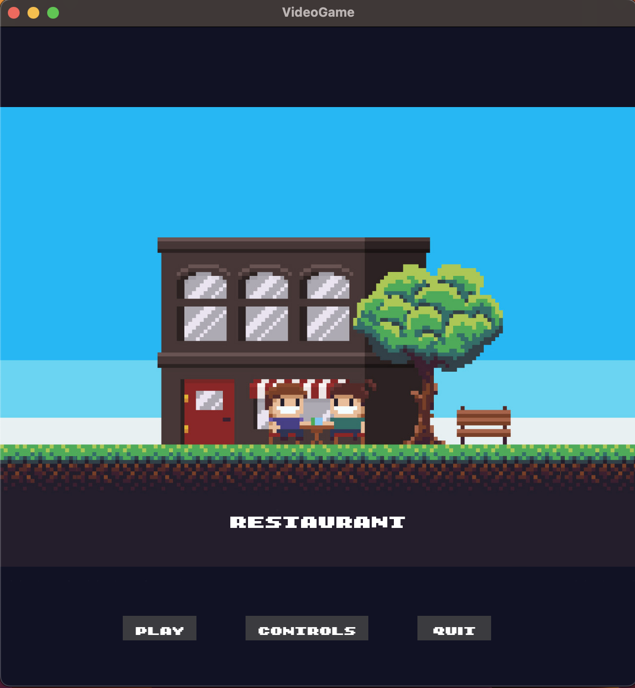
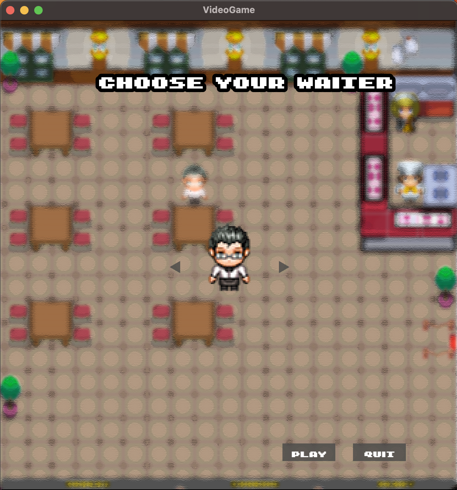
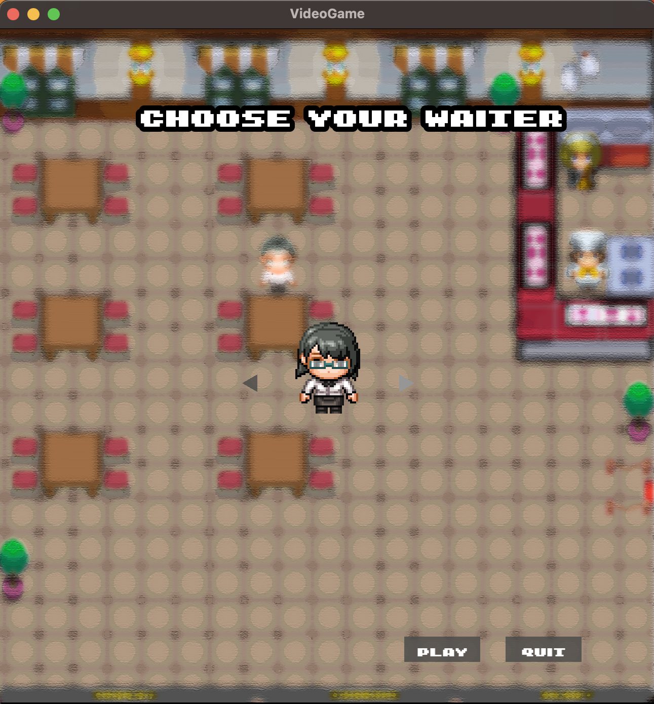

# Arcade Restaurant

## Table of Contents
* [General Info](#general-information)
* [Technologies Used](#technologies-used)
* [Features](#features)
* [Screenshots](#screenshots)
* [How To Play](#how-to-play)
* [Setup](#setup)
* [Project Status](#project-status)
* [Acknowledgements](#acknowledgements)
* [Contact](#contact)

## General Information
In this game you'll be a restaurant's waiter trying to satisfy customers requests.
You'll have to guide the customers to the tables, take orders, pick up and put down plates in the shortest time you can.
Each table that correctly served will give you an amount of points that will be determined by the service's time.
The customers' mood will decrease every time they have to wait, this could lead to a Game Over if their humor's indicator reaches zero.

## Technologies Used
- C++ Language
- SFML library
- Google Test

## Screenshots

### GIF

## How To Play
### Move the character: 
- A -> left 
- S -> down 
- D -> right 
- W -> up
### Interact: 
- J -> receive customers/take orders
- K -> pick up
- L -> put down.

## Setup
Scrivere cosa serve per avviare il progetto (Sfml)

## Project Status
Completed.

## Acknowledgements
The game idea is based on the creators' experience as waiters.

## Contact
credits to: Righi Ettore e Sbarzagli Paolo.
